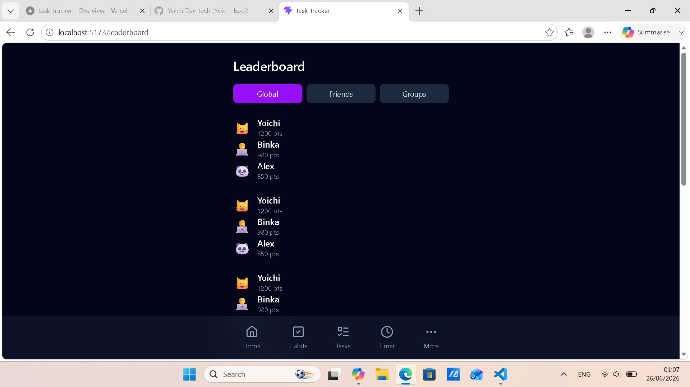

# TITLE

Task-Tracker

## SCREENSHOT

## DESCRIPTION

A modern, mobile‑first productivity app built with React + TypeScript.
Designed to help users manage tasks, build habits, and stay focused 
with a premium multi‑mode timer.
Everything is stored locally, works offline and feels like a real mobile app.

## CURRENT VERSION

MVP v2.3 - 26/06/2026

This release introduces the Premium Focus Timer System, including:

Timer Modes
-  Countdown Mode
-  Stopwatch Mode
-  Hybrid Mode

Timer Features
- Background‑resilient sessions
- Smart time display
- Premium animated progress ring
- Extend/reduce time freely
- Session summary popup
- Session history
- Daily & weekly streaks
- Longest session
- Average session
- Total sessions
- Points earned per session

UI/UX Improvements
- Icon‑based glowing tab selector
- Improved layout
- Better mobile experience
- Cleaner forms
- Smoother habit creation flow

## FEATURES

Tasks:
- Add new tasks
- Delete tasks
- Update task status (To‑Do => In‑Progress => Completed => loop)
- Status‑based styling
- Persistent storage
- Modern task cards

Habits:
- Add habits with frequency & remider time
- Track daily/weekly routines
- Earn points for completing habits
- Clean and modern UI

Timer: Three Modes
- Countdown = choose duration with hours/minutes
- Stopwatch = Open/Ended session
- Hybrid = stopwatch + optional target duration

UI/UX
- Light & Dark mode
- Mobile‑first layout
- Blurred bottom navigation
- Smooth transitions
- Reusable components
- Clean architecture

Leaderboard (New)
- Global leaderboard layout
- Emoji‑based avatars (lightweight, no images needed)
- Rank‑based ordering
- Clean list UI
- Future‑ready for friends/groups

## TECH STACKS

- React (Vite + TypeScript)
- React Router
- Tailwind CSS
- Lucide Icons
- LocalStorage persistence
- Node.js (development)
- Git & GitHub

## HOW IT WORKS

1 — App Initialization
Loads all saved data from LocalStorage:
Tasks
Habits
Points
Active minutes
Theme preference
Ongoing focus session (countdown / stopwatch / hybrid)
Session history

2 — Navigation
Users move between pages using the bottom navigation bar:
Home
Tasks
Habits
Timer

More

3 — Tasks
3.1 — User enters a task in the input field
3.2 — App creates a task object with a unique ID
3.3 — Task is saved to React state
3.4 — Task list is persisted to LocalStorage
3.5 — UI updates instantly

3.6 — When toggling a task's status:
todo => in‑progress => completed => todo
Status is updated in state
Saved to LocalStorage
UI applies new styling

3.7 — When deleting a task:
Removed from state
LocalStorage updated
UI re‑renders

4 — Habits
4.1 — User adds a habit with frequency + time
4.2 — Habit is saved to state + LocalStorage
4.3 — Displayed in a clean, modern list
4.4 — Completing a habit awards points

5 — Focus Timer (Premium 3‑Mode System)
5.1 — Mode Selection
User chooses between:
⏱ Countdown
🕒 Stopwatch
🎯 Hybrid
Tabs use glowing, icon‑based UI.

5.2 — Countdown Mode
5.2.1 — User selects hours + minutes
5.2.2 — App creates a countdown session
5.2.3 — Session is saved to LocalStorage (background‑resilient)
5.2.4 — Timer counts down in real time
5.2.5 — User can:
Extend time
Reduce time
Stop session
Mark as completed

5.2.6 — When session ends:
User chooses how to finish
Points + active minutes updated
Session saved to history
Streaks updated

Summary popup shown
5.3 — Stopwatch Mode
5.3.1 — User starts an open‑ended session
5.3.2 — Timer counts up  
5.3.3 — Session persists in background
5.3.4 — User stops or completes manually
5.3.5 — App saves:
Actual minutes
Session type
Date
Status

5.3.6 — Points + streaks updated
5.3.7 — Summary popup shown

5.4 — Hybrid Mode
5.4.1 — Starts as a stopwatch
5.4.2 — User optionally sets a target duration
5.4.3 — Premium progress ring activates
5.4.4 — User can:
Extend target
Reduce target
Stop session
Complete session

5.4.5 — App tracks:
Actual time
Target time
Completion percentage

5.4.6 — Session saved to history
5.4.7 — Streaks + points updated
5.4.8 — Summary popup shown
5.5 — Timer Persistence
All session types survive:
Page refresh
Tab close
App close
Phone lock
When the user returns:
Timer resumes
Or shows "Session Finished" screen if time expired

5.6 — Session History & Analytics
App automatically tracks:
Total sessions
Longest session
Average session
Daily streak
Weekly streak
Actual minutes focused
Points earned
All stored in LocalStorage.

6 — Home Page
6.1 — Shows total points
6.2 — Shows active minutes
6.3 — Shows quick links to Tasks & Habits
6.4 — Uses Material‑You inspired cards

7 — Theme System
7.1 — User toggles Light/Dark mode
7.2 — Theme applied instantly
7.3 — Preference saved to LocalStorage
7.4 — Tailwind classes update automatically

8 — Persistent Data
Everything is saved automatically:
Tasks
Habits
Points
Active minutes
Theme
Timer session
Session history

## BUGS (on current commit)

### Outdated (now fixed)
- Focus time locked at 0 minutes
- Task input & habit creation flow
- Name saving system in Settings
- Greeting persistence
- Developer mode unlock modal
- Contact Developer button
- LocalStorage schema updated for userName
- Leaderboard navigation crash
- Settings page crash (alertSound / alertVibration undefined)

### Still pending
- No backend sync yet
- No animations on page transitions
- No drag‑and‑drop for tasks
- No habit streak tracking (coming soon)
- No analytics dashboard
- No calendar to showcase streaks
- Numbers/scores color too dark
- Topbar topics too dark and unreadable
- Implement the Goals section
- Add the analytics feature
- Add badges emote/animation
- Implement a "notes" diary
- Implement the help section
- Work on the settings section
- Add an about section
- Develop the "data & privacy" section
- Leaderboard: add friends/groups tabs
- Leaderboard: add rank medals

## LEARNINGS

- Designing a scalable React architecture
- Managing multi‑page navigation
- Implementing theme systems with Tailwind
- Creating reusable UI components
- Persisting state with localStorage
- Building mobile‑first layouts
- Structuring a real productivity app beyond MVP

## FUTURE IMPROVEMENTS

- Page transition animations
- Drag‑and‑drop task sorting
- Habit streaks & analytics
- Categories & filtering
- Search bar
- Cloud sync / backend
- User accounts
- Widgets
- Weekly reports
- Achievements & gamification
- Leaderboard friends system
- Avatar customization
- Premium themes
- Calendar view for streaks
- Notes / journal system

## AUTHOR

Yoichi Dev