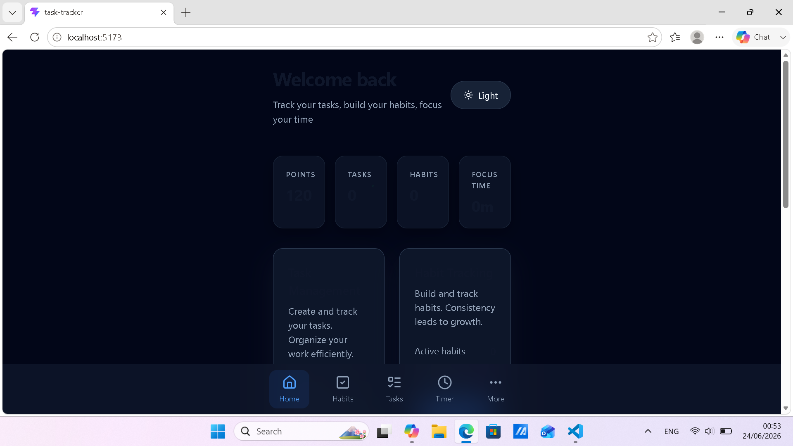

# TITLE

Task-Tracker

## SCREENSHOT

## DESCRIPTION

Task Tracker is a simple, beginner friendly React application designed to help users
manage their daily tasks.

## CURRENT VERSION

MVP v1.1 - 24/06/2026
This release introduces:
- Light/Dark theme toggle with persistence
- Updated navigation bar
- Improved task styling
- Better mobile layout
- LocalStorage persistence
- Cleaned architecture

## FEATURES

Tasks:
- Add new tasks
- Delete tasks
- Update task status (To‑Do => In‑Progress => Completed => loop)
- Status‑based styling
- Persistent storage
- Modern task cards

Habits:
- Add habits with frequency & time
- Track daily/weekly routines
- Earn points for completing habits

Timer:
- 25‑minute session timer
- Earn points for focus sessions

UI/UX
- Light & Dark mode
- Mobile‑first layout
- Blurred bottom navigation
- Smooth transitions
- Reusable components
- Clean architecture

## TECH STACKS

- React (Vite + TypeScript)
- React Router
- Tailwind CSS
- Lucid Icons
- Local Storage persistence
- Node.js (for development environment)
- Git & GitHub (version control and hosting)

## HOW IT WORKS

1 - The user opens the app, which loads all saved data (tasks, habits, points, theme) from localStorage.
2 - The user navigates between pages using the bottom navigation bar:
2.1 - Home
2.2 - Tasks
2.3 - Habits
2.5 - Timer
2.6 - More
3 - When the user adds a task, the app:
3.1 - Reads the text from the input field
3.2 - Creates a new task object with a unique ID
3.3 - Saves it to React state
3.4 - Persists it to localStorage
3.5 - Updates the UI instantly
4 - When the user toggles a task’s status, the app:
4.1 - Cycles the status in order:
4.1.1 - todo => in‑progress => completed => todo
4.1.2 - Updates the task in state
4.1.3 - Saves the updated list to localStorage
4.1.4 - Applies the correct visual style for the new status
5 - When the user deletes a task, the app:
5.1 - Removes it from state
5.2 - Updates localStorage
5.3 - Re-renders the task list
6 - All UI states are handled cleanly, including:
6.1 - Empty task lists
6.2 - Completed tasks with strike‑through
6.3 - Status‑based colors
6.4 - Light/Dark theme styles
6.5 - Mobile‑first layout
7 - The theme toggle:
7.1 - Switches between light and dark mode
7.2 - Updates the html class (light or dark)
7.3 - Saves the preference to localStorage
7.4 - Applies the correct Tailwind styles instantly
8 - The Habits page:
8.1 - Lets the user add habits with frequency and time
8.2 - Stores them in state and localStorage
8.3 - Displays them in a clean list
9 - The Timer page:
9.1 - Starts a 25‑minute focus session
9.2 - Adds points when the session ends
9.3 - Updates the user’s active minutes
10 - The Home page:
10.1 - Shows points
10.2 - Shows active minutes
10.3 - Shows quick links to tasks and habits
10.4 - Uses Material‑You inspired cards
11 - Every action is persistent:
11.1 - Tasks
11.2 - Habits
11.3 - Points
11.4 - Active minutes
11.5 - Theme

## BUGS (on current commit)

- No backend sync yet
- No animations on page transitions
- No drag‑and‑drop for tasks
- No habit streak tracking
- No analytics dashboard

## LEARNINGS

- Designing a scalable React architecture
- Managing multi‑page navigation
- Implementing theme systems with Tailwind
- Creating reusable UI components
- Persisting state with localStorage
- Building mobile‑first layouts
- Structuring a real productivity app beyond MVP

## FUTURE IMPROVEMENTS

- Add animations (page transitions, task interactions)
- Add drag‑and‑drop task sorting
- Add habit streaks & analytics
- Add categories & filtering
- Add search bar
- Add cloud sync / backend
- Add user accounts
- Add widgets
- Add weekly reports
- Add achievements & gamification

## AUTHOR

Yoichi Dev