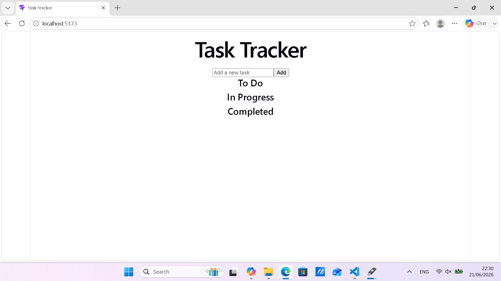

# TITLE

Task-Tracker

## SCREENSHOT

## DESCRIPTION

Task Tracker is a simple, beginner‑friendly React application designed to help users manage their daily tasks.
This is the MVP version that focuses on the core functionalities only, which are add & delete a task 
and/or update its status.
## CURRENT VERSION

MVP v1.0 - 21/06/2026
This version includes the minimum features needed for a basic functionality required for a tracking app.

## FEATURES

- Add new tasks
- Delete existing tasks
- Update task status (To‑Do → In‑Progress → Completed)
- Tasks automatically grouped by status
- Clean and simple component structure
- Fully functional React state management
- Beginner‑friendly architecture for future expansion

## TECH STACKS

- React (Vite + JSX)
- JavaScript (ES6+)
- HTML5 / CSS3
- Node.js (for development environment)
- Git & GitHub (version control and hosting)

## HOW IT WORKS

The app stores all tasks inside React state using useState.
Each task has:
- id (unique identifier)
- title (task name)
- status ("todo", "in-progress", "completed")
The user can:
- Add a task using the input form
- Delete a task using the delete button
- Toggle a task's status, which moves it between the three sections
Tasks are displayed in three grouped lists:
- To‑Do
- In‑Progress
- Completed
All updates re-render automatically thanks to React's state system.

## BUGS (on current commit)

Status toggle cycles only forward (todo => in-progress => completed) and does not loop back.
No visual styling yet (plain HTML layout).
No strike‑through effect for completed tasks.
No "X" delete icon — uses a basic button.
No separate pages for each status (all sections on one screen).
No persistence — tasks reset on page refresh.
No search, filters, or categories.

## LEARNINGS

Structuring a React project with reusable components
Passing props between parent and child components
Managing state with useState
Updating arrays immutably in React
Handling form submissions and controlled inputs
Debugging component logic and event handlers
Designing an MVP before adding advanced features
Thinking in terms of UI => components => state => behavior

## FUTURE IMPROVEMENTS

Add strike‑through styling for completed tasks
Replace delete button with a clean "X" icon
Add separate pages for To‑Do, In‑Progress, and Completed
Add categories and filtering
Add search functionality
Add localStorage or backend persistence
Add animations and improved UI/UX
Add dark mode
Add project dashboard and progress ring
Add drag‑and‑drop task movement
Deploy to GitHub Pages

## AUTHOR

Yoichi Dev